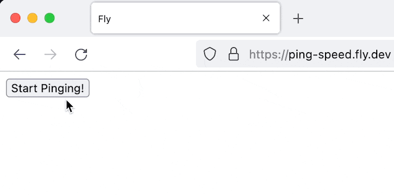
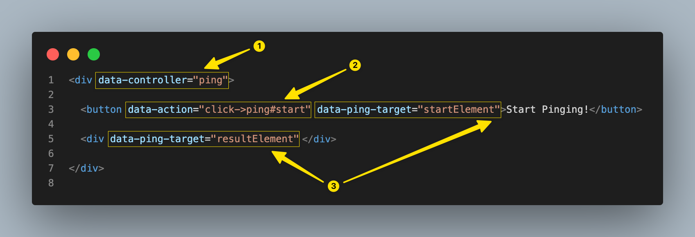
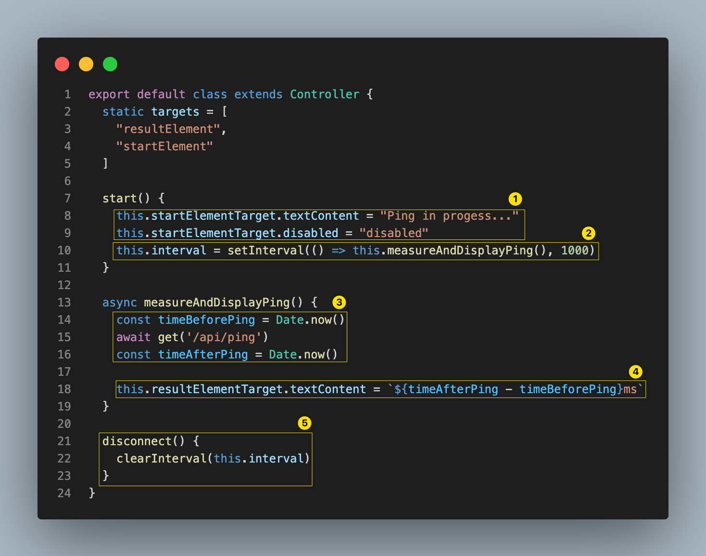
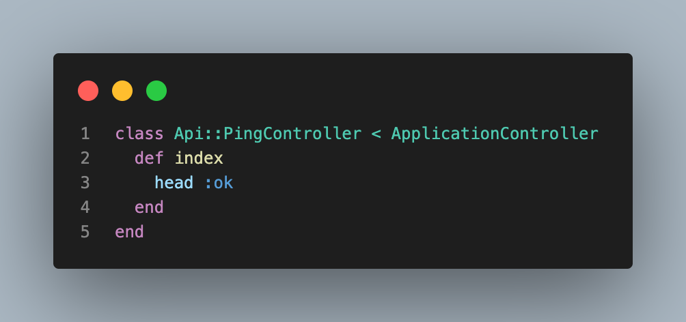

# Measuring Network Latency Using the Hotwire Framework

Jakob Nielsen published his famous "response times" guideline almost thirty years ago in his groundbreaking book, [Usability Engineering](https://www.nngroup.com/books/usability-engineering/). He makes the following observations about application response time:

> * less than 100 milliseconds: users feeling that they are directly manipulating objects in the UI
> * 200 milliseconds - 1 second: users notice the delay and thus feel the computer is 'working' on the command
> * more than 1 second: [we need to] indicate to the user that the computer is working on the problem

It follows that speeding up application response time by hundreds of milliseconds can make a tangible difference to the end user.

## Problem

Using the [Single Page Application (SPA)](https://en.wikipedia.org/wiki/Single-page_application) architecture, the only full page load of the HTML shell happens initially. From that point on, managing and rendering view state happens on the client - therefore network latency doesn't affect the user experience.

In the case of an application using the [Hotwire framework](https://hotwired.dev/) however, the views are rendered dynamically on the server. Thus, the total network response time becomes an important factor contributing to overall responsiveness. Longer network transfer times mean a less responsive application, impacting the user experience directly.

How can we ensure the best possible network reponse time for our application?

To paraphrase Peter Drucker, "You can't improve what you don't measure." Let's build a tool that can measure the network latency (the roundtrip network time to get from the client, to the server, and back to the client):

When the user clicks the "Start Pinging!" button, the application sends a request to the server every second, and displays the roundtrip time in milliseconds.

How could we implement this tool using the Hotwire framework, using the least possible amount of custom Javascript?

## Solution

The first question we should be asking ourselves when implementing a feature with Hotwire is: Which part of the framework should we use? Can we manage with [Turbo](https://turbo.hotwired.dev/) only (if so, do we need [Drive](https://turbo.hotwired.dev/handbook/drive), [Frames](https://turbo.hotwired.dev/handbook/frames), or [Streams](https://turbo.hotwired.dev/handbook/streams)) or do we need to reach after [Stimulus](https://stimulus.hotwired.dev/)?

The answer is provided in the introduction of the [Turbo Handbook](https://turbo.hotwired.dev/handbook/introduction):

"... it’s not possible to call custom JavaScript functions as part of a Turbo Streams action. ... Turbo focuses squarely on just updating the DOM, and then assumes you’ll connect any additional behavior using Stimulus actions and lifecycle callbacks."

In other words, Turbo's goal is to manage standard navigation (clicking links, submitting forms) and REST-style responses. If we need anything outside the standard request/response cycle, we need Stimulus.

Let's start by creating the server-side view:

Her's a rundown of the important parts:

1) `data-controller` sets the scene - it tells Stimulus to monitor this section of the DOM tree. The attribute value `ping` means that the code will reside in a Stimulus controller named `ping_controller.js`.
2) `data-action` uses a simple DSL to describe that if the element receives a `click` event, the `start` function of `ping` controller should be called.
3) `data-ping-target` annotates elements that are of interest to the controller (typically input/output placeholders.) In this case we marked two elements with `startElement` and `resultElement`. We'll se how are we going to use them in a second.

Let's see the implementation of the Stimulus controller.

1) If the user clicks the *Start Pinging* button, we want to update the button text and disable the element to make it clear that measuring is in progress. We can do this in a simple and clean way using the [Stimulus targets API](https://stimulus.hotwired.dev/reference/targets); no need to use custom Javascript to locate the elements. We can reference the element by it's target name, `startElement`
2) We are going to call the `measureAndDisplayPing` method every second.
3) We are making the call to the server, storing the current time before and after the request.
4) We are calculating and displaying the roundtrip time, by updating the element annotated with `resultElement`.
5) It's important to clean up after ourselves by calling `clearInverval()`. `disconnect()` is a perfect place to do so, as it's called automatically by Stimulus when the [controller is disconnected](https://stimulus.hotwired.dev/reference/lifecycle-callbacks#disconnection).

And finally, here's the implementation of the `PingController` that we called in step 3 above:

The controller does the least possible amount of work - just responding with `head: ok`. This is intentional, since we want to measure the network response time, and thus avoid talking to the database or perform any time-consuming action that would add extra time on top.

## Discussion (optional)Discussion
